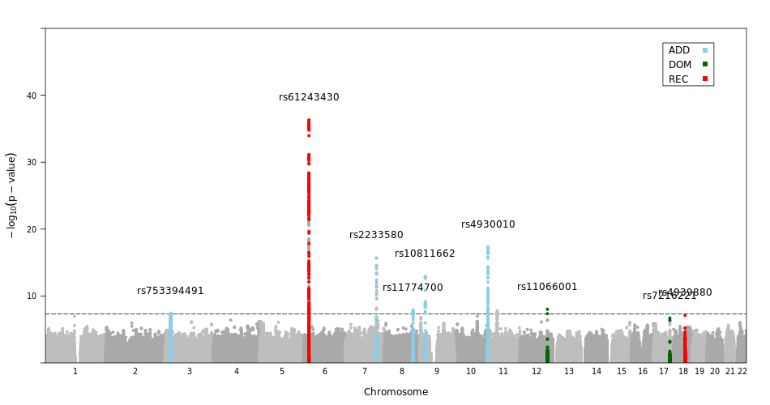

# TheraDARPLOT 
## **TheraDARPLOT:** A high-quality visualization of three genetic models plots using genome-wide association data
The [**TheraDarplot**](https://github.com/Dahyun-Park/DARplot/) is a specialized form of scatterplot to display **genome-wide association studies (GWAS)** of three genetic models (Dominance, Additive and Recessive). 
Our results indicate that the combining methods of **three mode GWAS results** should increase the opportunity 
the significant and replicative results and reduce the substantial loss of power. Based on our study, 
we implemented a R package named 
**TheraDARPLOT** **(Dominance, Additive and Recessive combined Plot).** 

**Availability**: TheraDARPLOT is available for free (under the GNU General Public License V3) from git-hub and from the CRAN R package repository cran.r-project.org/web/packages/ TheraDARPLOT/.
#### **Contact : kyungwon.hong@theragenetex.com or dahyun.park@theragenetex.com**

## Introduction
The R package DAR-PLOT facilitates the evaluation and visualization of the highest p-values among the three genetic models.


## Installation
To install `Darplot`, use the standard R package installation command.

```{r}
# install.packages('DARplot')
```
## Usage
### Basic Darplot
To illustate its usage, let us plot the coronary artery disease GWAS based on *Deloukas et al*(2013). The original dataset provides nominal p-values. Since we want to plot the $-log_{10}(P\text{-}value)$, let us take the logarithm.  


```{r,cache=TRUE}
library(DARplot)
DARplot::inputfile("mydir")
```
## Basic Manhattan plot

```{r,cache=TRUE}
ann<-snpannot(dar$SNP, dar$CHR, dar$BP, dar$P,kbaway=50)
```

## TheraDarplot

```{r,cache=TRUE}
ann<-snpannot(dar$SNP, dar$CHR, dar$BP, dar$P,
              snplist=c("rs633715","rs6803519","rs62456689","rs651821", "rs568974867"),
              col=c("green","red","blue")[c(1,3,1,2,3)], kbaway=50)
```

## Plotting multiple GWAS studies
```{r,cache=TRUE}
ann<-snpannot(dar$SNP, dar$CHR, dar$BP, dar$P,
              snplist=c("rs633715","rs6803519","rs62456689","rs651821", "rs568974867"),
              col=c("green","red","blue")[c(1,3,1,2,3)], kbaway=50)
```
```
DAR.plot(dar$CHR, dar$BP, dar$P,
               annotate=ann, ann.default=list(label=list(offset=2)),
               sig.level=5e-8,
               key=list(background="white", border=T, padaring.text=3,
                        corner=c(.95, .95, .95), text=list(lab=c("Add","DOM","REC")),
                        points=list(col=c("red","green","blue"), pch=20)))
```

## Make png
```
png("colorchange.png", width=1000, height=450, units="px",pointsize=12)
dev.off()

```

## Tabling
To install `tabling`, use the standard R package installation command.
```
library(DARplot)
DARplot::tabling("mydir")

```
