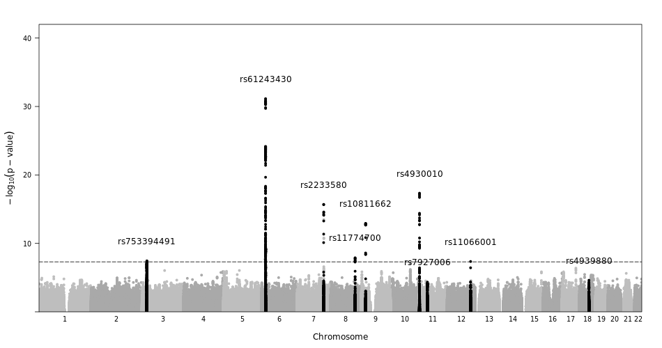
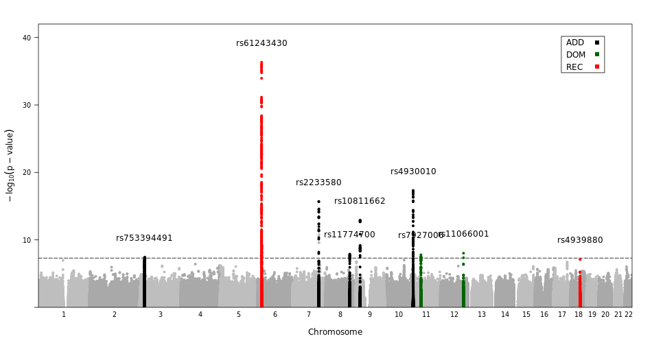

# TheraDARPLOT 
## **TheraDARPLOT:** A high-quality visualization of three genetic models plots using genome-wide association data
The [**TheraDarplot**](https://github.com/Dahyun-Park/DARplot/) is a specialized form of scatterplot to display **genome-wide association studies (GWAS)** of three genetic models (Dominance, Additive and Recessive). 
Our results indicate that the combining methods of **three mode GWAS results** should increase the opportunity 
the significant and replicative results and reduce the substantial loss of power. Based on our study, 
we implemented a R package named 
**TheraDARPLOT** **(Dominance, Additive and Recessive combined Plot).** 

**Availability**: TheraDARPLOT is available for free (under the GNU General Public License V3) from git-hub and from the CRAN R package repository cran.r-project.org/web/packages/ TheraDARPLOT/.
#### **Contact : kyungwon.hong@theragenetex.com or dahyun.park@theragenetex.com**

## Introduction
#### The R package DAR-PLOT facilitates the evaluation and visualization of the highest p-values among the three genetic models.

The genome-wide association studies (GWAS) is usually not known the mode of inheritance (dominance, additive and recessive). Assuming an incorrect mode of inheritance may lead to substantial loss of power.



**Figure 1** shows how significant markers are found when a manhattanplot is drawn with an additive model. In the figure below, only 7 significant markers were observed. 




**Figure2**, drawn by TheraDarplot shows the total 9 SNPs siginifianct markers that do not appear significantly in the additive model add significant markers when the Dominant and Recessive models

## Installation
To install `Darplot`, use the standard R package installation command.

```{r}
# install.packages('DARplot')
```
## Usage
To illustate its usage, let us plot the T2DM disease GWAS based on *DARPlot*. The original dataset provides nominal p-values. Since we want to plot the $-log_{10}(P\text{-}value)$, let us take the logarithm.  

### Load the library

```{r,cache=TRUE}
library(lattice)
library(dplyr)
library(DARplot)
```
## Prepare Darplot input file

```{r,cache=TRUE}
DARplot::inputfile("mydir")
dar<-read.csv("all.csv", header=T, as.is=T, sep="\t")
```

## Self annotation TheraDarplot

```{r,cache=TRUE}
ann<-snpannot(dar$SNP, dar$CHR, dar$BP, dar$P,
              snplist=c("rs633715","rs6803519","rs62456689","rs651821", "rs568974867"),
              col=c("green","red","blue")[c(1,3,1,2,3)], kbaway=50)
```

## function annotation TheraDarplot

```{r,cache=TRUE}
mer<- filter(dd, P <=5*10e-8 )
a = list()
for (i in sort(unique(mer$CHR))) {
  x = mer %>% filter(CHR == i) %>% select(P)
  y = which(x == min(x))
  b = mer %>% filter(CHR == i) %>% select(SNP) %>%as.vector
  a[[i]] = b[y,]
}
```
Find the highest significant SNP for each chromosome. If it is an add model, it draws a black column, when it is a dom model, it draws a green column, and when it is a rec model, it draws a red column. 

```
ann<-snpannot(dd$SNP, dd$CHR, dd$BP, dd$P,
              snplist = a ,
              kbaway=100,
)
```

## Plotting TheraDarplot(Three genetic models)

```
DAR.plot(dar$CHR, dar$BP, dar$P,
               annotate=ann, ann.default=list(label=list(offset=2)),
               sig.level=5e-8,
               sug.level=1e-5,
               key=list(background="white", border=T, padaring.text=3,
               corner=c(.95, .95, .95), text=list(lab=c("Add","DOM","REC")),
               points=list(col=c("red","green","blue"), pch=20)))
```

## Make TheraDarplot figure file(.png)
```
png("colorchange.png", width=1000, height=450, units="px",pointsize=12)
dev.off()

```

## Show a comparison Tabling(add,dom,rec)

To install `tabling`, use the standard R package installation command.
```
library(DARplot)
DARplot::tabling("mydir")

```
